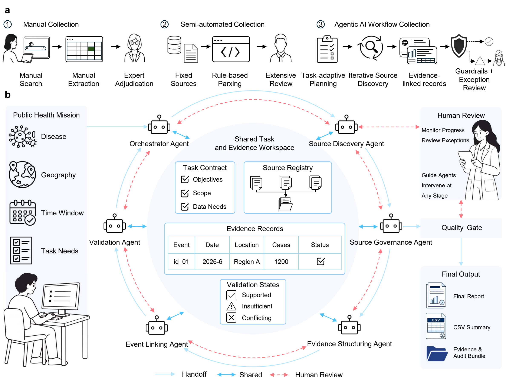

# Data Collection Workflow

[](docs/assets/figure-1.pdf)

Collect public-health information for a disease, location, and date range. The workflow discovers sources, retrieves documents, extracts structured observations, checks their supporting evidence, and exports data with source references.

The collection process is: **define the task → discover sources → retrieve documents → extract and check evidence → export data and reports**.

This repository contains the application, configuration templates, documentation, optional interfaces, and software tests. Sessions, downloaded documents, logs, generated reports, and research results are created locally when you run it. They belong under `outputs/`, which Git ignores. Files in `tests/` are test code and fixed test inputs, not saved test-run reports or completed collection sessions.

## Source discovery in evidence mode

For a task spanning a date range, the workflow uses representative months and bounded date-gap queries, balances search opportunities across official reports, databases, literature, and media, and follows explicitly linked report pages and previous/next versions. A separate report-date timeline helps identify further retrieval opportunities without treating gaps as missing reports or zero cases.

Live evidence discovery also looks up historical page-version metadata in the Internet Archive CDX index within the shared budget. These index records are discovery candidates, not downloaded historical page bodies or qualified observations. Set `universal.historical_discovery.enabled` to `false` in a task configuration to disable those lookups. See [Configuration](docs/configuration.md#historical-source-versions) for limits and provenance rules.

## Step 1. Download the project and install Python dependencies

Install **Git** and **Python 3.11 or newer** first. On Windows, use a short ASCII checkout path such as `C:/Projects/data-collection-workflow`; some packaging and OCR tools have trouble with long or non-ASCII paths.

Open a terminal in the folder where you want the project, then follow the commands for your shell.

**Windows PowerShell:**

```powershell
git clone https://github.com/XueyiZhang75/data-collection-workflow.git
cd data-collection-workflow
python --version
python -m venv .venv
.\.venv\Scripts\Activate.ps1
python -m pip install -e .
Copy-Item .env.example .env
```

**macOS or Linux:**

```bash
git clone https://github.com/XueyiZhang75/data-collection-workflow.git
cd data-collection-workflow
python3 --version
python3 -m venv .venv
source .venv/bin/activate
python -m pip install -e .
cp .env.example .env
```

Keep this terminal open and run the remaining commands from the project root. If you open a new terminal, return to this directory and activate `.venv` again. Keep the source checkout: the command-line runner uses its `scripts/` and `configs/` directories.

Confirm the command is available:

```bash
data-collection-workflow --help
```

If PowerShell blocks activation, install and check the command using the virtual environment directly:

```powershell
.\.venv\Scripts\python.exe -m pip install -e .
.\.venv\Scripts\data-collection-workflow.exe --help
```

Then use `.\.venv\Scripts\python.exe` instead of `python`, and `.\.venv\Scripts\data-collection-workflow.exe` instead of `data-collection-workflow`, throughout this tutorial.

## Step 2. Add your search and model credentials

Open the `.env` file you just copied. Fill in the key for **Tavily** and the key and model ID for **one** supported model provider.

For OpenAI:

```dotenv
TAVILY_API_KEY=YOUR_TAVILY_API_KEY
LLM_PROVIDER=openai
LLM_MODEL=YOUR_OPENAI_MODEL_ID
OPENAI_API_KEY=YOUR_OPENAI_API_KEY
```

For Anthropic:

```dotenv
TAVILY_API_KEY=YOUR_TAVILY_API_KEY
LLM_PROVIDER=anthropic
LLM_MODEL=YOUR_ANTHROPIC_MODEL_ID
ANTHROPIC_API_KEY=YOUR_ANTHROPIC_API_KEY
```

Replace the `YOUR_...` values with your own account settings. Tavily supplies live search; the selected model assists with task understanding, source planning, and extraction. There is no preselected model: use an exact model ID available to your account. Live search and model requests use those accounts and may incur provider charges.

Collection commands load `.env` automatically. Existing shell variables take precedence over `.env`; command-line provider/model arguments override task configuration, which overrides environment values. Keep API keys in `.env` or your environment, not in task JSON files. `.env` is ignored by Git.

## Step 3. Prepare the browser and OCR tools

This tutorial uses **`evidence` mode**, which provides field-level evidence checks, browser/OCR acquisition, persisted budgets, a recovery loop, and checkpoint resume. It requires Chromium and Tesseract even if a particular task eventually uses only text pages. The Python installation in Step 1 already includes PDF parsing libraries.

Install Chromium for the active Python environment:

```bash
python -m playwright install chromium
```

On a supported Linux system that needs browser system libraries, use `python -m playwright install --with-deps chromium`. See the [Playwright browser installation instructions](https://playwright.dev/python/docs/browsers).

Install **Tesseract 5** using the [Tesseract installation guide](https://tesseract-ocr.github.io/tessdoc/Installation.html). On Windows, that guide links to the UB Mannheim installer. Install all six language/data files required by this workflow: **`eng`, `osd`, `fra`, `spa`, `por`, `chi_sim`**.

Check the installation:

```bash
tesseract --version
tesseract --list-langs
```

The version must start with 5, and the language list must contain all six names. If `tesseract` is not on your PATH, run these checks with the full executable path. For example, in PowerShell:

```powershell
& "C:/Program Files/Tesseract-OCR/tesseract.exe" --list-langs
```

If the workflow cannot find Tesseract or its language files, set these values in `.env`, using your actual installation paths:

```dotenv
TESSERACT_EXECUTABLE="C:/Program Files/Tesseract-OCR/tesseract.exe"
TESSDATA_DIR="C:/Program Files/Tesseract-OCR/tessdata"
```

See [Runtime setup](docs/runtime.md) for custom Chromium paths, OCR self-check fonts, and Windows OCR path settings. The workflow checks browser, PDF, and OCR readiness locally before sending provider requests in evidence mode.

## Step 4. Choose a task and preview its settings

You need four task inputs and a name for this run:

| Input | Meaning | Example used below |
| --- | --- | --- |
| `--disease` | Disease or virus to collect information about | `Measles` |
| `--location` | Geographic scope | `Canada` |
| `--start-date` | Start of the requested period | `2025-01-01` |
| `--end-date` | End of the requested period | `2025-01-31` |
| `--session-id` | Local name for this run; use letters, digits, `_`, or `-` | `my_first_collection` |

The example defines a task; it does not load a bundled case dataset. Replace the disease, location, and dates with your own task, keeping the quotation marks around names that contain spaces.

Preview a small first run:

```bash
python scripts/collect.py --pipeline-mode evidence --disease "Measles" --location "Canada" --start-date "2025-01-01" --end-date "2025-01-31" --session-id my_first_collection --quick-test-mode --no-dashboard --print-config-only
```

Check the displayed task, provider/model, acquisition settings, and operation budgets. `--print-config-only` prints a sanitized configuration and exits before collection; it does not call the search/model providers or create a session. A preview does not validate the account or install missing browser/OCR tools.

`--quick-test-mode` selects smaller live-run budgets. It still performs real searches, downloads, and model calls when collection starts. The budgets count operations; they are not a dollar spending cap. `--no-dashboard` keeps the first run entirely in the terminal.

## Step 5. Start collection

Run the same command without `--print-config-only`:

```bash
python scripts/collect.py --pipeline-mode evidence --disease "Measles" --location "Canada" --start-date "2025-01-01" --end-date "2025-01-31" --session-id my_first_collection --quick-test-mode --no-dashboard
```

The terminal prints the chosen provider and model, generated configuration path, session ID, and node progress. The workflow checks local acquisition tools and model compatibility, then proceeds through discovery, retrieval, extraction, validation, and export. Keep the terminal running until it reports completion or a stopping reason.

Alternatively, let the entry point ask for the task inputs:

```bash
python scripts/collect.py --pipeline-mode evidence --quick-test-mode --no-dashboard
```

Answer the disease, location, start/end dates, and session-name prompts. Press Enter to accept the generated session name or task description. A missing model selection is also requested in an interactive terminal.

## Step 6. Open and assess the results

For the named example, open `outputs/sessions/my_first_collection/`. For an automatically named run, use the session path printed in the terminal. Its saved input configuration is under `outputs/generated_configs/`.

Start with **`task_result.md`** for the task answer, **`final_report.md`** for collection status and limitations, and **`collection/final_dataset.csv`** for the qualified data. Use `result_manifest.json` when you need the detailed machine-readable status.

| Path inside the session | What to read it for |
| --- | --- |
| `task_result.md` | Answers supported by the qualified evidence for your task |
| `final_report.md` | Brief run summary: counts, coverage status, budgets, and limitations |
| `result_manifest.json` | Data availability, coverage, budget usage, and stopping reason |
| `collection/final_dataset.csv` | Qualified case and aggregate observations |
| `collection/final_case_dataset.csv` | Qualified individual-case observations |
| `collection/aggregate_dataset.csv` | Qualified aggregate observations |
| `collection/candidate_records.csv` | Records still awaiting sufficient evidence or review |
| `collection/context_records.csv` | Background or contextual observations |
| `collection/source_processing_status.csv` | Which sources were retrieved, processed, or contributed evidence |

The task report and data tables also have JSON versions. Other files in `collection/` include compatibility views and review exports; they are not separate independent datasets. In evidence mode, `workflow_run_report.md` and `workflow_interpretive_report.md` repeat the run summary.

The task report lists up to 30 qualified observations with source references; use the CSV files for the full data. The workflow does not automatically produce a final PDF report or an epidemic-curve figure. Its HTML console displays collection status, while the optional dashboard exposes execution details.

A run that stops during setup may not have these final files; use its terminal error and saved session status to diagnose the problem.

You can inspect the session and pending review items from the terminal:

```bash
data-collection-workflow inspect-run --session-dir outputs/sessions/my_first_collection
data-collection-workflow review-summary --session-dir outputs/sessions/my_first_collection
```

An observation row is not necessarily one patient. A completed execution can have incomplete coverage or no qualified observations. Check the manifest and the cited evidence before using the data. `review-summary` displays the review queue; it does not itself apply decisions to an existing session.

Generated reports and interface labels use English. Quotations, original source names, and localized search terms retain their source language.

To export the collection data, run summary, manifest, and console to another local directory:

```bash
data-collection-workflow export --session-dir outputs/sessions/my_first_collection --output-dir outputs/exports/my_first_collection --format both
```

The export includes the collection data, a run summary, and its manifest, but does not copy `task_result.md` or `task_result.json`. Copy those task-answer files separately when sharing a complete result package.

## Step 7. Run a larger task or resume an interrupted session

For a run with the regular interactive budgets, omit `--quick-test-mode` and use a **new session ID**. Preview the new settings before starting:

```bash
python scripts/collect.py --pipeline-mode evidence --disease "Measles" --location "Canada" --start-date "2025-01-01" --end-date "2025-01-31" --session-id my_full_collection --no-dashboard --print-config-only
```

Remove `--print-config-only` to execute. Use a new ID whenever you change the task, configuration, model, code, or resources. Changing the model provider also requires choosing a model for that provider, for example `--provider openai --model "YOUR_OPENAI_MODEL_ID"`.

To continue an existing evidence-mode session created by `scripts/collect.py`:

```bash
python scripts/collect.py --resume-session my_first_collection --no-dashboard
```

Resume loads its saved task and configuration. It preserves used budgets, cached successful responses, and checkpoints. Keep the original code/resources and session files. Resuming does not reset exhausted budgets or clear a provider-account stop; explicit budget amendments and provider recovery are explained in [Configuration](docs/configuration.md#recovery-and-review).

## Step 8. Use a configuration file for repeated or customized tasks

Use this route when you want to edit target fields, search/fetch limits, model settings, or allowed/blocked source domains. Start from the blank template and keep your task file in the Git-ignored `configs/local/` directory.

**PowerShell:**

```powershell
New-Item -ItemType Directory -Force configs/local
Copy-Item configs/workflow.jsonc configs/local/my_task.jsonc
```

**macOS or Linux:**

```bash
mkdir -p configs/local
cp configs/workflow.jsonc configs/local/my_task.jsonc
```

Edit `configs/local/my_task.jsonc`:

1. Set the top-level `pipeline_mode` to `"evidence"`.
2. Replace the empty `structured_task` object with your task, for example:

   ```json
   "structured_task": {
     "disease": "Measles",
     "location": "Canada",
     "start_date": "2025-01-01",
     "end_date": "2025-01-31",
     "target_fields": [
       "disease", "country", "subnational_location", "date_reported",
       "cases_confirmed", "deaths", "source_url", "source_type", "evidence_quote"
     ]
   }
   ```

3. In the existing `output` object, set `session_id` to `"my_configured_collection"`. Leave `run_output_root` as `"outputs"`.
4. Leave `llm.provider` and `llm.model` blank to inherit `.env`, or fill both explicitly. Adjust the limits described in [Configuration](docs/configuration.md#budgets) if needed. The file-driven runner uses the file/default budgets; it does not add the interactive quick-run preset.

Preserve the surrounding commas when editing the JSONC template. Validate and preview it:

```bash
data-collection-workflow validate-config --config configs/local/my_task.jsonc
data-collection-workflow collect --config configs/local/my_task.jsonc --dry-run
```

Resolve any validation issues and confirm `valid: true`. Then start the configured run:

```bash
python scripts/run_workflow.py --config configs/local/my_task.jsonc
```

To resume it later, keep the same configuration file:

```bash
python scripts/run_workflow.py --config configs/local/my_task.jsonc --resume-session my_configured_collection
```

`pipeline_mode` belongs in the configuration for this route: `scripts/run_workflow.py` and the installed `collect` subcommand do not accept `--pipeline-mode`. The separate `workflow.collection_mode` setting controls source/validation roles. `standard` pipeline mode runs the regular collection and validation chain; `evidence` adds evidence qualification and persisted recovery. See [Configuration](docs/configuration.md) for the full distinction and user-supplied offline inputs.

## Troubleshooting

| What you see | What to do |
| --- | --- |
| `data-collection-workflow` is not found | Activate the project's virtual environment and rerun `python -m pip install -e .`. |
| Missing API key or missing model | Check `.env`, the matching provider key, and `LLM_MODEL`. Check whether an existing shell variable overrides the file. |
| Model preflight or account error | Use a model supported by your account and check the provider's error. When switching providers, set both `--provider` and `--model`. |
| Browser executable is missing | Run `python -m playwright install chromium` in the same virtual environment. |
| Missing OCR languages or failed OCR readiness | Check Tesseract 5, all six language files, and the paths in [Runtime setup](docs/runtime.md). |
| An existing session has a different configuration or fingerprint | Use a new session ID for the changed task, or restore the original settings and explicitly resume. |
| Run stops at its budget | Inspect `result_manifest.json`; resume with an explicit amendment if appropriate, or create a new run with reviewed limits. |
| No qualified rows | Read the task result, manifest, candidate records, and source-processing status to see whether the cause was unavailable sources, scope mismatch, missing evidence, or budget limits. |

## Optional interfaces

Terminal collection works without Langflow, Studio, or Streamlit. To add the live dashboard:

```bash
python -m pip install -e ".[visualization]"
python -m streamlit run scripts/dashboard.py -- --session-dir outputs/sessions/my_first_collection
```

Langflow and Studio have separate optional dependencies and launchers. See [Code map](docs/code_map.md) for their entry points.

## Project layout and software tests

```text
src/data_collection_workflow/  Workflow nodes, model adapters, evidence checks, runtime, and reports
  agents/                     Model-assisted source planning and assessment
  nodes/                      Collection and validation steps
  resources/                  Policies, prompts, disease knowledge, and compatibility test inputs
scripts/                      Terminal entry points and optional interfaces
configs/workflow.jsonc        Blank task configuration template
integrations/langflow/        Optional visual interface components
tests/                        Test code and fixed inputs used to check software behavior
docs/                         Configuration, runtime setup, and code map
```

`session_runtime.py` implements session storage and resumption; it is application code. The actual session state, raw documents, caches, and checkpoints are generated in each local output directory. Local task files in `configs/local/`, machine settings in `.runtime/`, `.env`, `outputs/`, and test-report/cache directories are ignored by Git.

Developers can run the software tests with:

```bash
python -m pytest
```

Prepare the browser and OCR tools before running the complete suite. Tests use temporary directories, fixed inputs, and mocked provider responses. Passing software tests does not establish factual accuracy for a live collection task.
